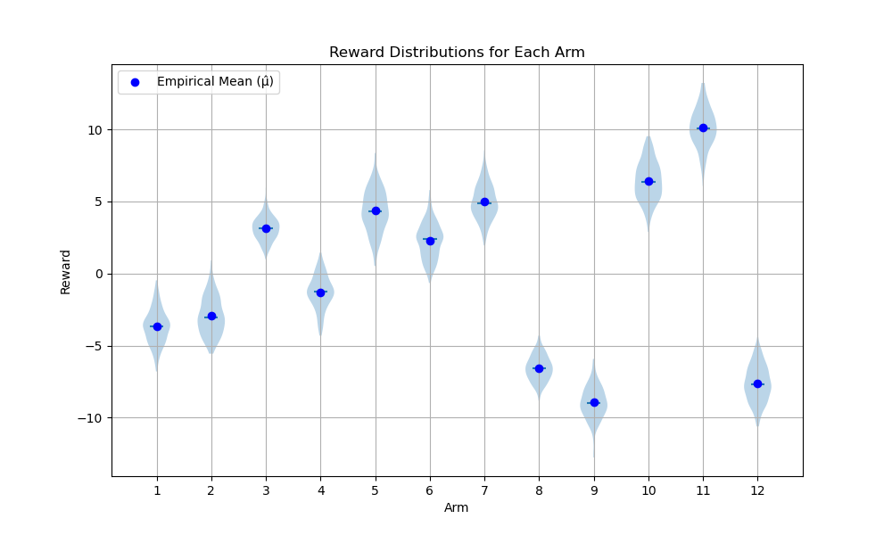
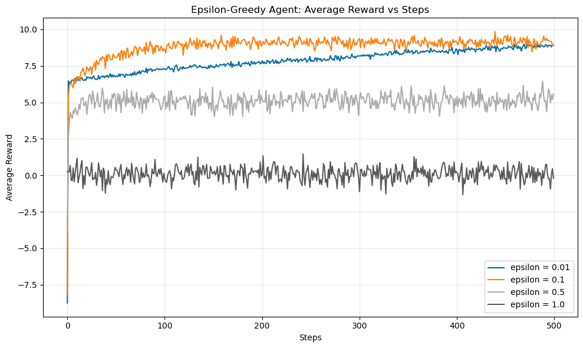
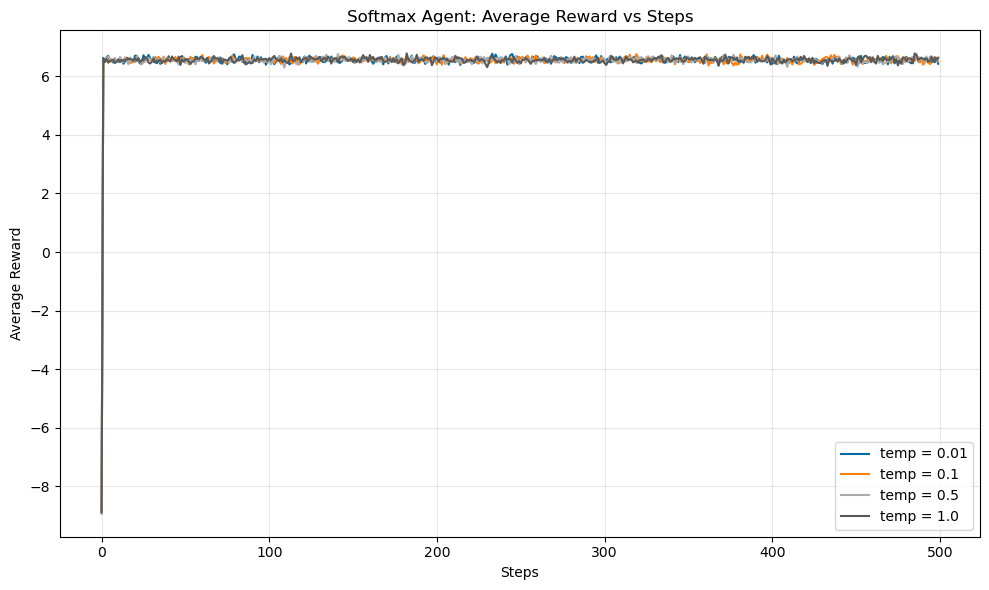
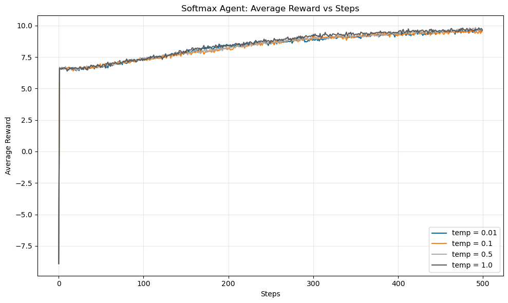
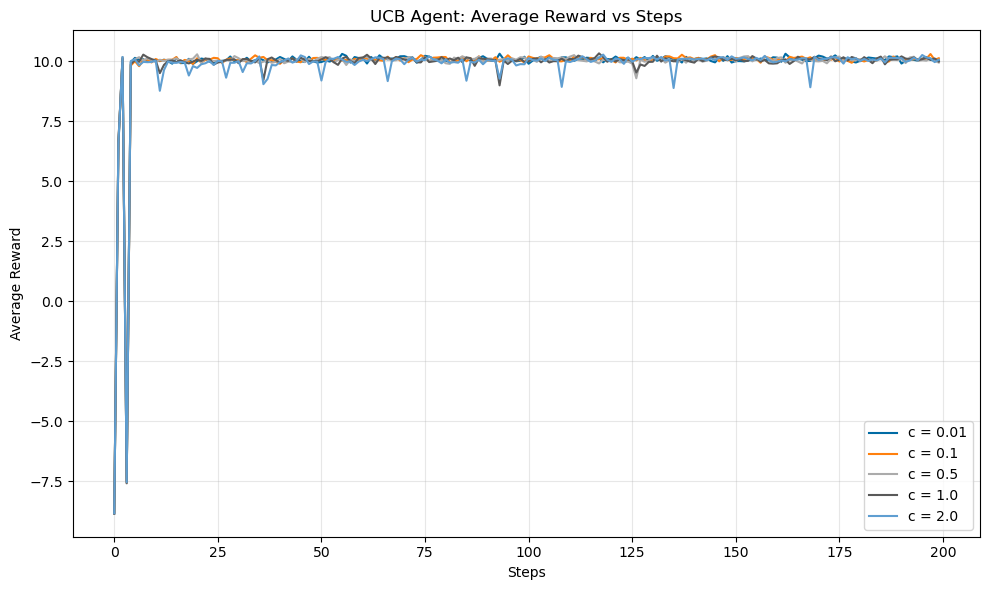

# Lab 3: Contextual Bandit-Based News Article Recommendation

## Overview
This project is part of the Reinforcement Learning Fundamentals course. It focuses on implementing a contextual bandit-based recommendation system for news articles. The system uses user and article data to recommend relevant articles to users.

## Project Structure
- **`master.ipynb`**: The main notebook for the project, including data loading, preprocessing, and contextual bandit implementation.
- **`classifiers.py`**: Includes helper functions and classes for classification tasks.
- **`bandit.py`**: Contains bandit base class called `MultiArmedBandit` which calls `rlcmab_sampler` to sample rewards.
- **`agents.py`**: Contans all the agent base classes implements $\epsilon$-Greedy, Softmax, and UCB algorithms.
- **`experiments.py`**: Functions to run multiple experiments and plot results.

## Running the Experiments
All data processing, classification, and comparison of different multi-arm bandit algorithms is done in one go in the `lab3_results_u20230102.ipynb` notebook. Simply run all cells of this notebook to reproduce results.

## Design Decisions
- The 12 arms and 3 agents mapping, as prescribed in the lab handout, has been implemented throughout.
- While running multiple experiments, an equal number of experiments are ran for each user category and the average rewards are calculated on basis of all the user agents.
    - That is, the are results shown as a function of the algorithms and hyperparameters and not as a function of the user categories.

## Results 

### Underlying Reward Distribution
By pulling the arms multiple times, we can get an estimate of the underlying reward distribution used in the `rlcmab_sampler` library.

We can clearly see the highest mean reward being close to 10, and the mean rewards across all arms and users being close to 0. 

This implies that in the tests we run, we should see the average reward tending towards 10.

### $\epsilon$-Greedy Results

For high values of $\epsilon$, we can see that the agent keeps exploring and thus it's average reward is also not as high as it can be.

For $\epsilon = 0.1$, we see relatively fast convergence, and for $\epsilon = 0.01$, the convergence is very slow. Both of these do converge to the top reward of 10. 

### Softmax Results

The above results are of softmax with a non-optimistic initial value of 0. We can see that for any value of the temperature parameter, the agent does not converge to max average reward of 10.

From the above image, we can see that for a more optimistic initial value of 3, softmax does converge overtime.

### UCB Results

We can see that UCB agents tend to converge very quickly. For higher values of c, we can see that the agent tends to overestimate the variance in arms and pulls the non optimal arms, which is highlighted by the dips in the average reward.

### Comparision of Algorithms
1. Speed
    - UCB converges the fastest.
2. Stability
    - Upon reaching convergence, softmax has the most predictable and stable response, without much exploration.
3. Hyperparameter Independent
    - UCB appears to converge without having a large hyperparameter dependency.
    - Softmax is dependent on initial value to reach the optimal reward.
    - $\epsilon$-Greedy is also dependent on $\epsilon$ for convergence, speed, and stability.
